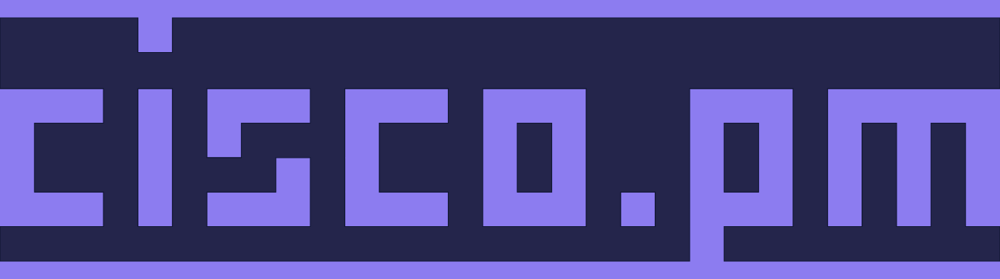

  
   
    
   <a>React app to configure Cisco devices - </a><a href="https://cisco.pm">live version</a>
   
   
  
  
  
  
  

---

---

## Selfhosting

Refer to the [docker-compose.yml](https://github.com/tawfekk/cisco.pm/blob/main/docker-compose.yml) (please note that shared sessions won't work when selfhosting)

## Development

To build and run cisco.pm in your local dev environment, follow these steps:
<ol>
   <li>Make sure you have the latest stable version of Yarn installed</li>
   <li>Clone this repository: <code>git clone https://github.com/tawfekk/cisco.pm.git</code></li>
   <li>Install dependencies: Run <code>yarn</code> inside the project folder</li>
   <li>Start the dev server: Run <code>yarn run start</code>. A new browser window will open on: http://localhost:3000</li>
</ol>

## Need Help?

Feel free to reach out on email: [info@cisco.pm](mailto:info@cisco.pm)

## License

cisco.pm is licensed under the terms of the [MIT License](https://github.com/tawfekk/cisco.pm/blob/main/LICENSE)
